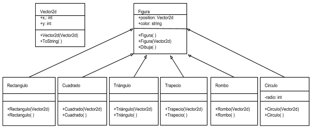

# **Tarea 3**
## **Unidad 3: Herencia.**
### 1. Define: 
###    Clase Base.
####   _Una clase base es aquella que no depende ninguno de sus atributos u objetos de alguna otra clase,          se podría decir que en términos de herencia, seria la clase padre, la clase que se mantiene fija,          en el aspecto de herencia._
####   _Es también por así llamarlo la clase principal de un programa, seria la clase primaria sin incluir         la clase main en donde se corre todo el programa en si._
###    Clase Derivada.
####   _Son clases que dependen de las clases bases, una clase derivada (subclase) puede redefinir métodos         (comportamientos) de su clase base (superclase)._
####   _Cuando en la subclase un método redefinido es llamado por su nombre, entonces se usa el método de          la subclase, para usar el método “original” de la superclase se debe indicar explícitamente_

### 2. Haz un diagrama UML donde se muestre la relación de herencia entre las  clases Figura, Recangulo y         Circulo


### 3. Indica cuales son las clases base y las derivadas.
####   _La clase base es Figura y las derivadas son Rectangulo, Cuadrado, Triangulo, Trapecio, Rombo y             Circulo._

### 4. ¿Que es herencia simple y herencia múltiple? 
####    Herencia simple.
####    _La herencia simple es la más típica, la que se puede encontrar en cualquier lenguaje moderno._
####    _La herencia simple es una relación entre una clase padre (clase base) y una clase hija (clase              derivada) llamada "es un tipo de".
####    _La herencia es simple cuando la clase derivada que estamos considerando sólo tiene una clase               base._
####    Herencia múltiple.
####    _Hace referencia a la característica de los lenguajes de programación orientada a objetos en la             que una clase puede heredar comportamientos y características de más de una superclase._
####    _La herencia múltiple permite a una clase tomar funcionalidades de otras clases._
####    ¿En c# se puede hacer herencia múltiple?
####    _No_

### 5. Escribe el programa de Figura.
####   La palabra base sirve para:
####   _Acceder a los miembros de la clase base desde una clase derivada:_
####   _Llamar a un método en la clase base que haya sido reemplazado por otro método._
####   _Especificar a qué constructor de clase base se debe llamar cuando se crean instancias de la clase          derivada._
```csharp
using System;
using System.Collections.Generic;

namespace Figura
{
    class Vector2d
    {
        public int x, y;

        public Vector2d(int x, int y)
        {
            this.x = x; 
            this.y = y;
        }

        public override string ToString()
        {
            return String.Format("{0}, {1}", x, y);
        }
    }
    class Figura
    {
        public Vector2d position;
        public string color;

        public Figura(): this(new Vector2d(100, 100))
        {
        
        }

        public Figura(Vector2d pos)
        {
            position = pos;
        }

        public virtual void Dibuja()
        {
            Console.WriteLine("Se dibuja una figura en la posición {0}, color {1}", position, color);
        }
    }

    class Rectangulo: Figura
    {
        public Rectangulo(Vector2d pos): base(pos)
        {
            color = "Blanco";
        }

        public Rectangulo(): base()
        {
        
        }
    }

    class Cuadrado: Figura
    {
        public Cuadrado(Vector2d pos): base(pos)
        {
            color = "Gris";
        }

        public Cuadrado(): base()
        {
        
        }
    }

    class Triangulo: Figura
    {
        public Triangulo(Vector2d pos): base(pos)
        {
            color = "Verde";
        }

        public Triangulo(): base()
        {
        
        }
    }

    class Trapecio: Figura
    {
        public Trapecio(Vector2d pos): base(pos)
        {
            color = "Morado";
        }

        public Trapecio(): base()
        {
        
        }
    }

    class Rombo: Figura
    {
        public Rombo(Vector2d pos): base(pos)
        {
            color = "Rojo";
        }

        public Rombo(): base()
        {
        
        }
    }

    class Circulo: Figura
    {
        private int radio;

        public Circulo(Vector2d pos, int radio): base(pos)
        {
            this.radio = radio;
        }

        public Circulo (): base()
        {
            this.radio = 10;
            color = "Negro";
        }

        public override void Dibuja() 
        {
            Console.WriteLine("Se dibuja un Circulo en la posición {0}, color {1}", position, color);
        }
    }

    class Program
    {
        static void Main(string[] args)
        {
            List<Figura> figuras = new List<Figura>();
            figuras.Add(new Circulo());
            figuras.Add(new Rectangulo(new Vector2d(150, 150)));
            figuras.Add(new Cuadrado(new Vector2d(50, 50)));
            figuras.Add(new Triangulo(new Vector2d(500, 500)));
            figuras.Add(new Trapecio(new Vector2d(520, 520)));
            figuras.Add(new Rombo(new Vector2d(90, 90)));
            foreach(Figura f in figuras)
            f.Dibuja();
        }
    }
}
'''